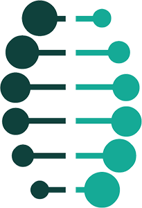

# Norme des services numériques

La Norme des services numériques expose 14 points visant à aider le gouvernement à concevoir et offrir des services en ligne d'excellence

Tous les nouveaux services et renseignements publics, ainsi que ceux faisant l'objet d'une refonte, devront à terme être conformes à la présente norme avant d'être mis en ligne. Mais, avant cette phase, nous souhaitons tester cette norme et recueillir les avis des utilisateurs afin de l'améliorer.

Merci d'envoyer vos idées et réflexions à : 
[digital.standard@ontario.ca](mailto:digital.standard@ontario.ca).

[Licence du gouvernement ouvert – Ontario](https://www.ontario.ca/fr/page/licence-du-gouvernement-ouvert-ontario)

## Phases de déploiement
Nous ne sommes qu'aux prémices de ce projet. Nous vous encourageons à adopter cette norme autant que possible et à nous faire part de vos retours.

| Besoins des usagers |            |
| ---------- | ---------- |
|  | <h3>Découverte (juin-juillet)</h3>Mener une recherche auprès des usagers des Services numériques de l'Ontario et des partenaires cruciaux |
|  | <h3>Alpha (juillet-septembre)</h3>Publier une première ébauche et la mettre à jour une fois par mois selon les rétroactions des usagers et les analytiques du Web |
|  | <h3>Bêta (octobre-mars)</h3>Poursuivre la mise à jour des normes et ajouter un plus grand nombre de guides en se fondant sur les rétroactions des usagers et les analytiques |
|  | <h3>Mise en ligne (mars-mai)</h3>Publication des normes avec des liens vers les communautés de pratique, maintien des mises à jour continuelles |

## 1 — Former une équipe adaptée

Mettez en place une équipe pluridisciplinaire et durable capable de concevoir, de créer et d’améliorer de façon continue les services numériques. Elle doit être dirigée par un chef de produit qualifié pour prendre des décisions.

Les chefs de produit établissent la stratégie applicable au service et définissent les caractéristiques propres à celui-ci. Le service est en permanence sous leur responsabilité, jusqu'à sa désactivation. Ce poste est différent de celui de chef de projet.

Un produit désigne tout ce qui est créé pour un groupe spécifique d'utilisateurs. Dans la présente norme, le terme «?produit?» fait référence à toute information en ligne ou à tout service transactionnel utilisé par les habitants de l'Ontario.

### Importance de la question

Il est important de posséder une bonne équipe pluridisciplinaire dirigée par une seule personne qui assume la responsabilité du projet et qui est autorisée à prendre des décisions en fonction des résultats des recherches, des tests et des prototypes note de bas de page 1 [1](#f1) .

Les compétences de votre équipe et les éléments sur lesquels elle se concentre doivent évoluer tout au long de la conception et du développement du service. Sa structure devra également s'adapter aux besoins du service et à la phase de travail en cours.

Pour assurer une réussite optimale, constituez une équipe dotée :

* d’un large éventail de compétences et de rôles, et ce, dès le départ;
* de processus de prise de décision rapides et d’une bonne capacité à s'adapter à l'évolution du service;
* des ressources et de la capacité à livrer le produit.

### Respect de la présente norme

Au minimum :

* constituez une équipe pluridisciplinaire bénéficiant d'une expertise dans la prestation de services selon les méthodes Agile [2](#f2), de compétences techniques, et de connaissances en matière d'expérience utilisateur et de politiques applicables;
* travaillez en collaboration;
* intégrez l'expertise d'autres secteurs d'activités et ministères (par exemple, une expertise financière, juridique ou en matière de politique) pour atteindre l'objectif souhaité;
* employez un responsable autorisé à prendre des décisions au quotidien dans le but d'améliorer le service;
* chargez un membre de l'équipe de se consacrer à la recherche utilisateur sur le projet pendant au moins 3 jours par semaine;
* partagez les missions principales dans l'équipe de façon à ce que personne n'assume plusieurs responsabilités;
* identifiez les éventuelles faiblesses de votre équipe et remédiez-y;
* procédez à des transferts de connaissances et de compétences entre les membres de l'équipe;
* continuez à améliorer le service, même une fois celui-ci déployé.

## 2 — Comprendre les utilisateurs et leurs besoins

Définissez le problème en commençant par les utilisateurs. Effectuez des recherches de façon à comprendre réellement qui ils sont, comment ils se comportent et ce que cela implique pour la conception du service.

### Importance de la question

Comprendre les personnes qui utilisent un service et leurs attentes est essentiel si l'on veut que celui-ci réponde à leurs besoins. Par exemple, les utilisateurs d'un service de renouvellement de permis de conduire sont l'ensemble des habitants de l'Ontario qui possèdent un permis de conduire.

Il est facile de formuler des hypothèses sur les utilisateurs ou de se laisser influencer par nos expériences personnelles. Il est donc important de trouver des utilisateurs aux expériences et points de vue divers.

Apprenez à connaître vos utilisateurs et leurs besoins, adoptez leur propre point de vue, en laissant la perspective du projet de côté.

Prendre le temps de comprendre ceux qui utilisent votre service vous aidera à :

* fournir de meilleures solutions et expériences de service;
* découvrir de nouvelles possibilités et idées;
* éviter de perdre du temps à mettre en place une idée ingénieuse de façon inappropriée.

Il est utile de définir le profil d'un utilisateur moyen, mais aussi celui des utilisateurs moins communs (ou «?utilisateurs atypiques?»). Ceux-ci comprennent les personnes qui peuvent être totalement satisfaites ou mécontentes du service. Ils constituent généralement une très bonne source d'idées : leurs besoins sont souvent des versions amplifiées de ceux des utilisateurs moyens.

Servez-vous de leurs besoins comme d'un guide qui vous aidera à faire ressortir les problèmes que les utilisateurs plus à l'aise avec la technologie auront du mal à formuler. C'est une étape essentielle pour concevoir des outils qui fonctionnent pour tous, et ainsi éviter d'engendrer des inégalités dans les services numériques.

Pour définir les caractéristiques du service, identifiez :

* les **objectifs des utilisateurs** - rédigés au format suivant : En tant que \[type d'utilisateur\], je veux
  \[objectif\] afin de \[raison\]
* des **personas** - des groupes d'utilisateurs constitués en fonction de leurs habitudes, de leur personnalité et de leurs motivations.
* des **profils utilisateurs** - des groupes d'utilisateurs constitués selon des données démographiques, comme l'âge, le genre, la localisation, le revenu et la taille de la famille

### Respect de la présente norme

Au minimum :

* établissez une liste complète de vos utilisateurs et de leurs besoins;
* montrez quels groupes ont participé et lesquels ne l'ont pas fait;
* remédiez à tout problème ou manquement lors de la phase bêta;
* donnez des exemples d'expériences utilisateurs, de personas et de types d'utilisateurs pour le service;
* identifiez les parties du service qui ont posé des difficultés aux utilisateurs et tout problème qui doit être résolu lors de la conception du service.

À l'étape suivante :

* testez le service avec de vrais utilisateurs en tenant compte :
  * du nombre de participants et de leurs caractéristiques démographiques générales;
  * de la proportion d'utilisateurs participants ayant des difficultés en termes d'accessibilité;
  * de la façon dont ils ont été recrutés;
  * de la façon dont les données analytiques ont été utilisées lors de vos recherches;
  * de toute nouvelle idée ou leçon apprise.
* expliquez les changements émanant de ces recherches auprès des utilisateurs;
* évoquez les besoins des utilisateurs les plus difficiles à satisfaire;
* parlez des difficultés de conception que posent les besoins des utilisateurs.

Durant la phase de déploiement :

* montrez les recherches qui identifient les étapes qui posent des difficultés aux utilisateurs;
* montrez que des améliorations ont été apportées à ce niveau et comment elles ont été testées et conçues;
* évoquez la façon dont les résultats de vos recherches seront utilisés pour améliorer constamment le service (par exemple, les participants, la fréquence, la localisation, l'heure).

## 3 — Faire preuve de constance

Le public doit retirer de toute interaction avec le gouvernement de l'Ontario une expérience cohérente, positive et constante.

### Importance de la question
Les utilisateurs doivent être en mesure de déterminer lorsqu'ils sont sur un site officiel du gouvernement.

Utiliser des plateformes et modèles standardisés permet à la fois de rentabiliser la prestation des services publics et d'utiliser au mieux les ressources publiques.

### Respect de la présente norme

Ontario.ca est le site Internet phare du gouvernement. Au minimum :

* ajoutez le nouveau contenu sur Ontario.ca, au lieu de créer de nouveaux sites Web ou applications mobiles;
* utilisez l'adresse Ontario.ca/mot-clé pour les sites et le marketing, au lieu d'enregistrer un nouveau nom de domaine public (par exemple, Ontario.ca/digitalservice, au lieu de digitalservice.on.ca);
* transférez le contenu prioritaire et le plus demandé sur Ontario.ca;
* utilisez Ontario.ca comme voie d'accès pour toutes les applications transactionnelles sur les autres plateformes (telles que le RAFEO
* expliquez comment le service a utilisé les normes de conception du site Ontario.ca;
* appliquez les normes de contenu du site Ontario.ca afin de conserver le ton du contenu gouvernemental;
* affichez votre contenu principal sur Ontario.ca, pour qu'il soit plus facile à trouver, à comprendre et à utiliser;
* collaborez avec l'équipe des Services numériques de l'Ontario;
* démontrez que le service est adaptatif et qu'il fournit le même contenu et les mêmes fonctionnalités sur tous les appareils, y compris sur les appareils mobiles;
* enregistrez le nom de domaine sur [domain.registration@ontario.ca](mailto:domain.registration@ontario.ca), le cas échéant.

### Lois et règlements à respecter

* Accessibilité -
  [*Loi sur l’accessibilité pour les personnes handicapées de l’Ontario, Normes pour l'information et les communications*](https://www.ontario.ca/fr/lois/reglement/r11191#BK9)
* Français  -
  [*Loi sur les services en français*](https://www.ontario.ca/fr/lois/loi/90f32),
  [*Services gouvernementaux en français*](https://www.ontario.ca/fr/page/services-gouvernementaux-en-francais)
* Données ouvertes -
  [*Directive sur les données ouvertes de l’Ontario*](https://www.ontario.ca/fr/page/directive-sur-les-donnees-ouvertes-de-lontario)

## 4 — Prendre en charge l'expérience dans sa globalité

Comprenez le but des utilisateurs et les étapes qu'ils devront suivre pour accomplir cette tâche. Chaque contact avec le service devra les rapprocher de leur objectif. Si possible, chaque étape devra pouvoir être complétée en ligne.

### Importance de la question

Il est important de comprendre ce que les utilisateurs recherchent lorsqu'ils accèdent à un service, et quelle est la place de celui-ci dans leur vie quotidienne.

Leur expérience du service ne se limite pas à ce qu'ils font sur leur écran. Elle commence dès qu'ils entendent parler du service pour la première fois, et ne se termine que lorsqu'ils ont reçu le produit ou la confirmation finale.

Comprenez le cheminement global des utilisateurs pour atteindre leur objectif, y compris leurs actions sur Internet, au téléphone ou en personne. Chaque contact, qu'il soit en ligne ou hors ligne, doit être soigneusement étudié afin d'aider l'utilisateur à se rapprocher de son but.

### Respect de la présente norme

Au minimum :

* comprenez les étapes par lesquelles les utilisateurs doivent passer pour atteindre leur objectif et quelle est la place de votre service;
* assurez-vous que les prototypes intègrent l'expérience utilisateur de bout en bout;
* montrez les résultats de vos recherches et de vos tests utilisateurs, ainsi que la façon dont ils seront utilisés dans le but d'améliorer le service;
* mettez en place un plan de recherche utilisateur qui couvre l'ensemble des étapes de la conception du service jusqu'à son déploiement, et qui inclut les prochaines étapes de développement;
* expliquez la fréquence des recherches et des tests, et la façon dont les résultats seront exploités;
* effectuez des recherches utilisateurs dès le début avec des personnes rencontrant des problèmes d'accessibilité;
* réalisez des tests avec des utilisateurs ayant besoin d'aide pour accéder aux outils numériques;
* utilisez des données analytiques dans le cadre de votre plan de recherche utilisateur;
* montrez tout problème trouvé grâce à vos tests et les solutions que vous proposez.

## 5 — Veiller à ce que les utilisateurs atteignent leur but du premier coup

Utiliser un service gouvernemental devrait être intuitif et aisé. Un service bien conçu doit être tellement simple que les utilisateurs atteignent leur objectif du premier coup, sans avoir besoin d'aide.

### Importance de la question

Il est important de veiller à ce que votre service soit aussi simple et abordable que possible. Tous les utilisateurs devraient pouvoir aisément exploiter le service, même ceux dont l'accessibilité est limitée ou qui connaissent mal le numérique.

Si un service est trop complexe ou confus, les utilisateurs seront obligés de contacter l'organisation par téléphone ou de se déplacer pour obtenir de l'aide et achever leur tâche. Pire encore, ils peuvent éviter d'y avoir recours.

Cela entraîne non seulement des coûts supplémentaires, mais peut aussi occasionner une grande frustration pour l'utilisateur et une perte de confiance dans son gouvernement.

### Respect de la présente norme

Au minimum :

* expliquez le service et ce qu'il fait;
* montrez que la majorité des utilisateurs parvient à l'utiliser du premier coup;
* ayez recours aux recherches, aux tests et aux données analytiques pour améliorer régulièrement le service;
* démontrez que vous testez l'ensemble des expériences utilisateurs de bout en bout et qu'elles fonctionnent, y compris pour ceux ayant besoin d'aide pour accéder aux outils numériques;
* rendez les services accessibles, y compris aux utilisateurs dont les compétences numériques sont peu développées;
* effectuez des tests utilisateurs et introduisez les améliorations nécessaires;
* basez vos décisions en matière de conception et de contenu sur vos recherches, tests et données analytiques;
* assurez-vous que les utilisateurs peuvent naviguer dans le service du début à la fin, sans aide;
* testez le nom du service et vérifiez que les utilisateurs le comprennent;
* utilisez des données analytiques et vos recherches utilisateurs pour réduire le nombre de personnes qui n'accomplissent pas la tâche qu'elles souhaitaient effectuer en ligne (par exemple, renouveler leur permis de conduire).

## 6 — Tester le service de bout en bout

Testez le service de bout en bout de façon continue, afin de vérifier qu'aucune erreur ne survient et qu'il reste disponible.

Assurez-vous de le tester avec les navigateurs et appareils utilisés par votre public pour accéder au service, y compris les appareils fonctionnels. Un appareil fonctionnel est un appareil utilisé par une personne atteinte d’une déficience, qui doit l'aider dans sa vie quotidienne (par exemple, un lecteur d'écran ou une prothèse auditive).

### Importance de la question

N'attendez pas que les utilisateurs découvrent une erreur dans les services en ligne. Mettez en place des contrôles et faites en sorte d'éviter les périodes d'inaccessibilité. Les utilisateurs s'attendent à ce que les services numériques modernes soient disponibles 24 heures sur 24 et sept jours sur sept.

Faire tester le service de bout en bout directement par des utilisateurs permet de déceler les problèmes avant qu'ils ne prennent trop d'ampleur.

Les utilisateurs sont donc plus satisfaits et ont davantage confiance dans les services fournis par le gouvernement.

### Respect de la présente norme

Au minimum :

* concevez et testez le service de façon à ce qu'il fonctionne avec les navigateurs et appareils des utilisateurs, y compris les appareils fonctionnels;
* testez le service dans un environnement aussi semblable que possible à l'environnement de déploiement;
* concentrez-vous sur les besoins administratifs et sur les objectifs des utilisateurs (par exemple, lors de la refonte d'un programme tel que le RAFEO, cela consiste à tester les étapes que les étudiants doivent suivre pour remplir une demande en vertu du RAFEO. 
* fournissez des outils et de l'aide aux développeurs pour qu'ils puissent mettre le service à l’essai lors de sa création et après son déploiement;
* concevez un service qui peut prendre en charge un nombre d'utilisateurs plus important que celui prévu et qui peut aider un plus grand nombre d’utilisateurs si la demande augmente;
* segmentez le contenu, la conception et les fonctionnalités pour que les mises à jour puissent être réalisées sur chaque élément indépendamment des autres;
* adoptez un processus de test des modifications apportées au service;
* mettez en place un processus périodique de contrôle et de test du service, même quand il n'a pas subi de modifications;
* mettez en place un plan de gestion des erreurs (bogues, interruptions) et prévenez les utilisateurs;
* respectez les meilleures pratiques de codage recommandées pour vos technologies et outils;
* documentez les méthodes utilisées pour créer et maintenir le service, et tenez la documentation à jour;
* mettez en place un plan pour le stockage et la récupération des données.

## 7 — Rendre le service accessible

L'accessibilité est non seulement obligatoire, mais elle constitue également un bon modèle de conception. Assurez-vous que le service est accessible à tous les utilisateurs, quels que soient leurs capacités, leur appareil ou leur environnement.

### Importance de la question

Tous les utilisateurs doivent pouvoir atteindre leur objectif dès leur première utilisation du service, aussi rapidement et facilement que possible.

Ceci est également valable pour les utilisateurs atteints d’une déficience ou ceux ayant besoin d'aide pour accéder aux outils numériques. L'aide à l'utilisation des services numériques consiste à fournir une assistance aux personnes qui ne peuvent pas utiliser les services numériques par elles-mêmes. Elle comprend, entre autres, des options pour les aider à naviguer dans un service en ligne, par téléphone ou en personne.

Si les utilisateurs ont des difficultés à atteindre leur objectif du premier coup, ils pourraient ensuite éviter d'utiliser le service ou contacter votre organisation pour obtenir de l'aide.

Au minimum :

* respectez les
  [instructions visant à rendre l'information accessible](https://www.ontario.ca/fr/page/comment-rendre-linformation-accessible) publiées par la Direction générale de l'accessibilité pour l'Ontario;
* effectuez des recherches et des tests pour vous assurer que le service est accessible à tous les utilisateurs, quelles que soient leurs capacités;
* concevez un modèle d'aide à l'utilisation des services numériques pour répondre aux besoins des utilisateurs;
* ayez recours aux recherches, aux tests et aux données analytiques pour améliorer le service, y compris le modèle d'aide à l'utilisation des services numériques;
* expliquez l'ensemble des expériences utilisateurs de bout en bout, et montrez comment elles fonctionnent et ont été testées;
* assurez-vous que l'aide à l'utilisation des services numériques est financée de façon durable et reste gratuite.

### Lois et règlements à respecter

* [*Loi sur l’accessibilité pour les personnes handicapées de l’Ontario*](https://www.ontario.ca/fr/lois/loi/05a11), [Normes pour l'information et les communications](https://www.ontario.ca/fr/lois/reglement/r11191#BK9)

## 8 — Utiliser des méthodes agiles et axées sur l’utilisateur

Concevez et créez le service en utilisant une approche agile et axée sur l’utilisateur. Agile est une façon de créer des services en divisant l’ensemble du travail en blocs de plus petite taille appelés des itérations. Créez une fonctionnalité du service à la fois jusqu’à ce que tout le service soit terminé.

Cette méthode est beaucoup moins risquée que la méthode en cascade classique qui crée tout le service en une fois. En effet, le fait d’effectuer de nombreuses itérations met bien plus rapidement à jour les défauts du plan initial (impossibilité d’obtenir des autorisations, manque de ressources, mauvaises personnes dans l’équipe, etc.).

Les méthodes axées sur l’utilisateur (étude des utilisateurs, essais d’ergonomie) mettent l’accent sur la création de services faciles à utiliser. Les services gouvernementaux traditionnels se concentrent sur la satisfaction des besoins opérationnels et le respect des objectifs fixés par les politiques. Une méthode axée sur l’utilisateur veille à ce que les besoins opérationnels tiennent compte des besoins des utilisateurs. De cette manière, l’utilisation du service numérique tend à croître.

### Importance de la question

Les méthodes agiles créent des services qui sont en mesure :

* d’aboutir rapidement à un prototype (présenté aux utilisateurs afin de mettre en place une rétroaction régulière);
* de satisfaire les besoins des utilisateurs;
* d’évoluer facilement en cas, par exemple, de modifications dans les technologies ou dans les politiques gouvernementales;
* de s’améliorer en continu en fonction de la rétroaction des utilisateurs.

### Respect de la présente norme

Au minimum :

* travaillez de façon agile, à l’aide d’outils et de techniques agiles, et continuez de la sorte une fois que le service est opérationnel;
* assurez-vous que l’équipe examine et met à jour de façon incrémentielle les façons de résoudre les problèmes;
* donnez un exemple de la façon dont l’équipe a réagi en fonction d’un essai d’ergonomie et de l’étude des utilisateurs;
* montrez que votre service est géré de façon agile, en s’appuyant sur des objectifs clairs et mesurables;
* examinez les options de conception pour votre prototype et expliquez pourquoi certaines sont écartées;
* expliquez comment la conception du service a évolué au fil du temps à la lumière des résultats obtenus par l’étude des utilisateurs;
* identifiez tous les problèmes rencontrés au cours des recherches et les solutions pour améliorer le service.

## 9 — Utiliser des normes ouvertes et des plateformes communes

Utilisez des normes ouvertes, des logiciels ouverts et des plateformes gouvernementales communes, le cas échéant.

Les normes ouvertes et les logiciels ouverts sont publics, disponibles gratuitement pour tout le monde et leurs élaboration et mise à jour se font de façon collaborative.

### Importance de la question

L’utilisation de normes ouvertes et de plateformes gouvernementales communes permettra au gouvernement :

* d’économiser du temps et de l’argent en réutilisant ce qui est déjà disponible;
* de passer d’une technologie à une autre, le cas échéant;
* de faire évoluer rapidement et facilement un service, le cas échéant;
* d’offrir aux utilisateurs une expérience plus cohérente des services gouvernementaux en ligne;
* d’accéder à un éventail plus large de vendeurs de logiciels propriétaires et ouverts;
* d’éviter les contrats à long terme qui peuvent s’avérer restrictifs.

### Respect de la présente norme

Au minimum :

* utilisez des normes ouvertes et des plateformes communes;
* déterminez les plateformes communes à utiliser;
* comprenez les besoins que les utilisateurs ont couramment avec les autres services et satisfaites ces besoins de façon cohérente par rapport aux autres entités du gouvernement;
* montrez ce que le service offre aux utilisateurs et sous quel format (par exemple, un permis de conduire);
* expliquez quelles données sont utilisées et/ou recueillies et à quel moment elles seront publiées dans le cadre de la Directive sur les données ouvertes;
* utilisez des plateformes gouvernementales communes (Ontario.ca, Salle de presse de l’Ontario);
* intégrez les systèmes déjà en place.

### Lois et règlements à respecter

* [Directive sur les données ouvertes de l’Ontario](https://www.ontario.ca/fr/page/directive-sur-les-donnees-ouvertes-de-lontario)
* Plateformes standard
  * Publication en ligne - [Ontario.ca](https://www.ontario.ca/fr/page/gouvernement-de-lontario)
  * Nouvelles - [Salle de presse de l’Ontario](https://news.ontario.ca/newsroom/fr)
  * Données ouvertes -
    [Catalogue de données](https://www.ontario.ca/fr/recherche/donnees-publiques)

## 10 — Intégrer la sécurité et la protection de la vie privée au niveau de la conception

Identifiez les données que le service utilisera, stockera ou créera. Adoptez des mesures appropriées en matière juridique, de sécurité et de protection de la vie privée de façon à ce que les utilisateurs soient certains que leurs renseignements personnels seront conservés en toute sécurité et que la protection de leur vie privée sera assurée.

### Importance de la question

Pour que les utilisateurs utilisent un service, il est nécessaire de garantir les points suivants :

* sécurité du service;
* confidentialité du service;
* possibilité d’accéder à ses renseignements au sein du service lorsqu'on en a besoin.

### Respect de la présente norme

Dans les premières étapes d’élaboration, expliquez :

* les types de données recueillies (nom, adresse, code postal, etc.);
* le mode de transmission des données;
* le lieu et le mode de stockage des données;
* les menaces pour la sécurité, notamment les éventuelles voies d’accès que les pirates informatiques peuvent emprunter, ainsi que les méthodes éprouvées de réduction de ces menaces;
* la façon dont vous prévoyez de rester à jour concernant les menaces et la façon de les traiter;
* toutes les menaces de fraude existantes et les systèmes de contrôle en cours de prototypage.

Décrivez également :

* la méthode de gestion des risques et de la sécurité;
* les menaces pour la sécurité et la protection de la vie privée;
* vos interactions avec les équipes administratives et les équipes chargées des risques en matière d’information (par exemple, Services de sécurité et Information, protection de la vie privée et Archives publiques);
* les règlements relatifs à la sécurité et à la protection de la vie privée qui vous concernent et la façon dont ils seront respectés sans que la prestation ne soit exposée à un risque;
* toutes les questions déjà en cours qui vous concernent, notamment la protection ou le partage des données;
* les politiques qui vous concernent en matière de protection de la vie privée, et leur justification;
* les processus de mises à jour des serveurs/logiciels;
* le plan et le processus de demande des mises à jour de sécurité;
* le plan de vérification des activités suspectes;

Une fois que le service est opérationnel, décrivez :

* la méthode de gestion des risques et de la sécurité;
* les interactions continues avec les équipes administratives et les équipes chargées des risques en matière d’information (par exemple, Services de sécurité et Information, protection de la vie privée et Archives publiques);
* toutes les questions déjà en cours qui vous concernent, notamment la protection ou le partage des données;
* le processus de compréhension des nouvelles menaces et des menaces en cours, ainsi que de leur mode d’évolution au cours de la version bêta;
* la façon dont vous maintiendrez à jour les politiques en matière de protection de la vie privée.

### Lois et règlements à respecter

* [*Loi sur l’accès à l'information et la protection de la vie privée*][l1]
* [*Loi sur la protection des renseignements personnels sur la santé*?][l2]
* [*Loi sur les archives publiques et la conservation des documents*?][l3]
* [*Loi sur la protection des renseignements personnels et les documents électroniques*][l4]
* [*La Loi canadienne anti-pourriel*][l5]

[l1]: https://www.ontario.ca/fr/lois/loi/90f31
[l2]: https://www.ontario.ca/fr/lois/loi/04p03
[l3]: https://www.ontario.ca/fr/lois/loi/06a34
[l4]: https://www.priv.gc.ca/fr/sujets-lies-a-la-protection-de-la-vie-privee/lois-sur-la-protection-des-renseignements-personnels-au-canada/la-loi-sur-la-protection-des-renseignements-personnels-et-les-documents-electroniques-lprpde/r_o_p/
[l5]: http://fightspam.gc.ca/eic/site/030.nsf/fra/accueil

## 11 — Encourager tout le monde à utiliser le service numérique

Encouragez les personnes à choisir le service numérique à chacune de leurs interactions avec le gouvernement.

### Importance de la question

Le fait d’encourager les personnes à utiliser le service numérique permettra :

* d’économiser de l’argent en réduisant le nombre de personnes qui empruntent des canaux non numériques, notamment les centres d’appels;
* d’aider les utilisateurs à acquérir des compétences numériques;
* de mieux soutenir les personnes qui ne peuvent pas utiliser elles-mêmes des services numériques.

### Respect de la présente norme

Dans les premières étapes de d’élaboration :

* planifiez l’accroissement du nombre d’utilisateurs du service numérique;
* comprenez les autres canaux par lesquels le service est assuré;
* décrivez les données recueillies sur les autres canaux et leur mode de collecte sur chacun d’eux;
* identifiez les organismes et les groupes qui aident les utilisateurs à se servir des services numériques et non numériques déjà en place;
* constituez une base de connaissances à partir de l’étude des utilisateurs, notamment le profil démographique, les attitudes, les comportements, les canaux de préférence et la cartographie des parcours des utilisateurs[3](#f3)
* comprenez comment chaque canal satisfait les besoins des différents utilisateurs;
* concevez le service numérique de telle sorte qu’il présente des avantages indéniables par rapport aux autres canaux.

À l’étape ultérieure :

* planifiez l’accroissement du nombre d’utilisateurs du service numérique et illustrez-le à l’aide de données probantes;
* améliorez les communications avec les utilisateurs en vous appuyant sur la base de connaissances issue de leur étude;
* examinez les données analytiques concernant la façon dont la communication s’établit.

Une fois que le service est opérationnel :

* planifiez le transfert et l’accroissement du nombre des utilisateurs vers le service numérique et fixez des objectifs annuels sur 5 ans;
* mesurez l’incidence prévue sur les autres points de service (par téléphone, en personne) et la façon dont elle pourrait influencer l’attribution des financements et des ressources.

## 12 — Soutenir les personnes qui en ont besoin

Mettez en place dans tous les canaux des outils visant à soutenir les personnes qui ne peuvent pas utiliser elles-mêmes des services numériques.

## Importance de la question

Tout le monde ne disposera pas automatiquement du même niveau d’accès, de confort et de compétences pour utiliser le service numérique. Comprenez à quels niveaux les utilisateurs ont besoin de soutien, mettez ce soutien à disposition et sensibilisez à l’existence de ce soutien.

### Respect de la présente norme

Effectuez le plus tôt possible une étude des utilisateurs afin de :

* comprendre l’accès, la confiance et les compétences numériques dont disposent les utilisateurs;
* savoir pourquoi certains utilisateurs ne peuvent pas utiliser le service numérique de façon autonome, par exemple à cause d’obstacles dus à la maîtrise linguistique ou à la maîtrise d’Internet;
* découvrir les besoins des utilisateurs en matière de soutien;

Dans les étapes ultérieures d’élaboration, assurez-vous que l’aide numérique :

* est pérenne;
* est compréhensible et bien documentée;
* repose sur des méthodes de recrutement et de recherche appropriées;
* est constituée et expliquée à travers le prisme d’histoires, de personnages et de profils qui correspondent aux personnes qui en ont besoin.

Menez des recherches sur les utilisateurs qui :

* utilisent déjà ou utiliseront le service;
* disposent du niveau le plus bas d’accès, de confiance et de compétences numériques;
* font actuellement appel à d’autres personnes pour obtenir de l’aide numérique (amis, famille, collègues, entreprises ou organismes de bienfaisance).

Réagissez en fonction de l’étude des utilisateurs en :

* tirant les enseignements issus de l’étude et en soutenant les essais visant à améliorer l’aide numérique;
* chargeant une personne d’étudier en continu les besoins des utilisateurs en matière d’aide numérique.

### Lois et règlements à respecter

* [*Loi sur l’accessibilité pour les personnes handicapées de l'Ontario*, normes pour l’information et les communications](https://www.ontario.ca/fr/lois/reglement/r11191#BK9)

## 13 — Mesurer le rendement

Enregistrez et surveillez en permanence les données de rendement afin d’éclairer les améliorations du service en cours.

### Importance de la question

La mesure du rendement permet d’améliorer en continu un service en :

* montrant ses forces et ses faiblesses ;
* fournissant des données sur lesquelles s’appuyer pour effectuer des modifications.

### Respect de la présente norme

Au minimum :

* utilisez une analytique Web afin d’enregistrer des données concernant le comportement des utilisateurs en ligne;
* définissez les besoins, les sources et la collecte en matière de données;
* surveillez et évaluez les commentaires et les plaintes des utilisateurs concernant le service numérique et les autres points de contact du service (par téléphone, en personne);
* analysez le rendement et identifiez le plus tôt possible les données exploitables;
* utilisez des données qualitatives et quantitatives en vue de comprendre les besoins des utilisateurs et de repérer des domaines où des modifications pourraient être apportées;
* définissez des mesures du rendement dès le début du service, en amont dans le processus de conception;
* montrez à quel niveau le service se situe par rapport aux autres services similaires du gouvernement et du secteur privé.

## 14 — Mettre à l’essai en présence du ministre/de la ministre

Testez le service ou effectuez-en une démonstration du début à la fin en présence du ministre responsable/de la ministre responsable avant que le service ne soit rendu opérationnel.

### Importance de la question

Les ministres sont responsables du respect des priorités du gouvernement à l’égard des Ontariens et des Ontariennes. Vous devez donc leur montrer le service numérique avant de le rendre opérationnel.

### Respect de la présente norme

Au minimum, montrez le service au ministre/à la ministre/aux ministres qui en est/sont responsable(s). S’il s’agit d’un service transactionnel, faites tester le service de bout en bout par le ministre/la ministre/les ministres afin de s’assurer qu’il/elle/ils peut/peuvent l’utiliser comme l’aurait fait un électeur/une électrice.

---
## Importance de la question

La présente Norme des services numériques a été élaborée pour que le gouvernement de l’Ontario l’utilise au moment de concevoir des services d’information et des services transactionnels en ligne destinés à la population ontarienne.

Nous pensons qu’un service numérique optimal est pratique, intuitif et facile à utiliser. La Norme des services numériques a pour objectif d’aider le gouvernement de l’Ontario à assurer des services en ligne qui sont systématiquement de qualité.

La norme nous permettra de :

* définir ce qui constitue un service numérique de qualité en Ontario;
* déterminer les mesures que nous devons prendre pour y parvenir.

L’élaboration de la présente norme fait fond sur des recherches au Canada et à l’étranger. Elle repose sur les aspirations et les expériences d’équipes de toute la fonction publique de l’Ontario, ainsi que d’autres territoires de compétence, en particulier avec les services Gov.UK, USDS et 18F.

### Footnotes

* <a id="f1">1</a> anciennes versions d'un service, créées à des fins de test [↩](#a1)
* <a id="f2">2</a> [Agile](https://fr.wikipedia.org/wiki/M%C3%A9thode_agile)
   était au départ une approche alternative au développement de logiciels. Ces méthodes sont désormais appliquées à d'autres types de projets et de produits. Leurs principes sont définis dans le
   [Manifeste pour le développement Agile de logiciels](http://agilemanifesto.org/iso/fr/manifesto.html) [↩](#a2)
* <a id="f3">3</a> diagrammes de processus enregistrés à partir du point de vue de vos utilisateurs [↩](#a3)
