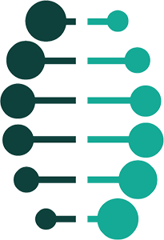
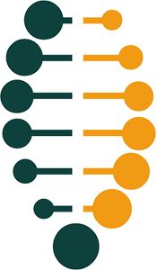

# Digital Service Standard

The Digital Service Standard sets out 14 points to help anyone build and deliver excellent government services.

[Guides and resources, case studies, and related rules](https://www.ontario.ca/page/build-ontario-government-services)

---

## Release Stages

We’re in the early days of bringing this standard to life. We encourage
you to adopt as much of the standard as possible, and to share your
feedback with us.

| User needs |            |
| ---------- | ---------- |
|  | <h3>Discovery (June-July 2017)</h3>Conducting user research to understand their needs |
|  | <h3>Alpha (July 2017-February 2018)</h3>Testing our hypotheses with users |
|  | <h3>Beta (From March 2018)</h3>Developing a minimum viable service |
|  | <h3>Live</h3>Continuing to improve based on user feedback |

## 1. Understand users and their needs

Start with users to define the problem. Do research to develop a deep understanding of who the users are, how they behave and what that means for the design of the service.

### Why it matters

Understanding the people who use a service and what they want is critical to building a service that works for them. For example, users of a driver’s license renewal service include any Ontarian with a driver’s license.

It’s easy to make assumptions about users or be influenced by personal experiences. When thinking about users, it’s important to find people with different experiences and perspectives.

It's especially important to include people with disabilities early.

Get to know your users and their needs from their point of view – beyond the lens of the project.

Taking the time to understand the people who use your service will help:

* deliver better solutions and service experiences
* discover additional opportunities and insights
* prevent wasted effort implementing the right idea in the wrong way

It’s helpful to define average users and the not-so-average users (also known as atypical users). Atypical users include those who may be extremely satisfied or extremely dissatisfied with the service. Atypical users are a great source of insight because their needs are generally amplified versions of the more average users.

Use the needs of atypical users as a compass to help articulate the challenges that more digitally savvy users will struggle to voice. This is critical to building tools that work for everyone and avoiding inequalities through digital services.

To inform service features, interview users and gather data to develop:

* **user goals** - written in this format: As a \[user type\], I want
  \[some goal\] so that \[some reason\]
* **user personas** - show user groups based on habits, personality,
  attitudes, abilities and motives
* **user profiles** - show user groups based on demographics such as
  gender, age, location, income and family size

### How to meet this standard

At a minimum:

* list a complete set of users and their needs
* show what groups contributed and what groups did not
* address any gaps when testing during the beta stage
* give examples of user stories, personas and profiles for the service
* identify parts of the service that users find difficult and any
  problems that need to be overcome to design the service

In the next stage:

* test the service with real users, and be able to explain:
  * number of test participants and their basic demographic characteristics
  * how many users involved in testing had accessibility challenges or needed assisted digital support
  * how they were recruited
  * how analytics were used in research
  * any new insights and lessons
* explain any changes identified as a result of researching with users
* discuss user needs that are most difficult to meet
* talk about the design challenges users’ needs pose for the service

In the live stage:

* show research that identifies parts of the task that users find
  difficult
* demonstrate improvements to those areas and how those were tested and
  researched
* talk about how research results will be used to continuously improve
  the service (e.g. participants, frequency, location, timing)
  
## 2. Establish the right team

Put a sustained multidisciplinary team in place that can design, build
and continuously improve the digital service, led by a skilled product
manager who is empowered to make decisions. 

Product managers set the strategy for and define features of a service. They are responsible for the service on an ongoing basis, until it is decommissioned. It’s not the same role as a project manager.

A product is anything created for a defined group of users. In this
standard, product refers to any online information or transactional
service used by the people of Ontario.

### Why it matters

It’s important to have a strong multidisciplinary team in place, led by
one person who is accountable and has the authority to make decisions
based on the outcomes of research, testing and prototypes[1](#f1).

The team’s skills and focus need to evolve as the service is designed
and developed. The team also needs to adapt its structure based on the
needs of the service and the phase of work.

To be successful, build a team with:

* a broad mix of skills and roles from the start
* quick decision-making processes and the ability to change and adapt as
  the service evolves
* the resources and ability to deliver the product

### How to meet this standard

At a minimum:

* build a multidisciplinary team with expertise in agile digital service
  delivery[2](#f2),
  technical, user experience and policy skills
* work collaboratively
* embed expertise from other business areas and ministries (e.g.
  finance, legal, policy, correspondence) to achieve desired outcomes
* have a manager with the ability to make day-to-day decisions on behalf of users
* dedicate one user researcher on the project for at least 3 days each
  week
* identify gaps in the team and fill them
* transfer knowledge and skills to others
* continue to improve the service after it’s gone live
* involve the maintenance team for the service early on in the project

## 3. Be consistent

When the public interacts with the Ontario government, their experience
should feel cohesive, positive and consistent.

### Why it matters

Users should know when they are on an official government website.

Using standard platforms and designs is a cost-effective way of
providing public services and makes the most of public resources.

Services delivered online, over the phone or in person should provide a 
consistent experience for the public. From branding to tone of voice and 
error handling, users should always feel confident in their ability to complete the service properly and our ability to guide them to the completion of their task.

### How to meet this standard

Ontario.ca is the government's flagship website. At a minimum:

* add new content to Ontario.ca, rather than create any new websites or
  mobile applications
* use an Ontario.ca/keyword for websites and marketing, rather than
  register any new public-facing domain names (e.g.
  Ontario.ca/digitalservice instead of digitalservice.on.ca)
* migrate high-demand, priority web content to Ontario.ca
* use Ontario.ca as the front door for all transactional applications on
  other platforms (such as OSAP)
* demonstrate how the service has used the Ontario.ca design standards
* apply [Ontario.ca content standards](https://www.ontario.ca/page/ontarioca-style-guide) to maintain the tone and voice of
  government content
* show core content on Ontario.ca that’s easy to find, understand and
  use
* work with the Ontario Digital Service team
* demonstrate that the service is responsive, with the same content and
  functionality on all devices, and works on mobile devices
* register the domain name through
  [domain.registration@ontario.ca](mailto:domain.registration@ontario.ca),
  if needed

### Laws and rules to follow

* Accessibility -
  [*Accessibility for Ontarians with Disabilities Act*, Information and Communication Standard](https://www.ontario.ca/laws/regulation/r11191#BK9)
* French language -
  [*French Language Services Act*](https://www.ontario.ca/laws/statute/90f32),
  [Government services in French](https://www.ontario.ca/page/government-services-french)
* Open data -
  [Open Data Directive](https://www.ontario.ca/page/ontarios-open-data-directive)
* Social Media - [Ontario Public Service social media guidelines](https://www.ontario.ca/page/ontario-public-service-social-media-guidelines)

## 4. Design the service from start to finish

Understand what users are trying to achieve and the steps required to
complete that task. Every encounter should move the user closer towards
their goal. Where possible, each step of the journey should be completed
online.

### Why it matters

It's important to understand what users are trying to do when they
access a service and how that service fits within the broader context of
their life.

The service experience is much more than what people interact with on
screen. It begins when they first hear about the service and it doesn't
end until they've received the final product or confirmation.

Understand the complete end-to-end journey that users take to complete
their objective, including the actions they take online, on a phone, or
in person. Every encounter — whether it's online or offline — needs to
be carefully considered and should help the user get closer to their end
goal.

### How to meet this standard

At a minimum:

* examine other channels to understand the steps users take to complete their goal and how your
  service fits
* show a journey map of all the touch points in a user's experience of the service, from awareness of the service to completion and receipt of product (if applicable)
* demonstrate that there is a plan for error recovery at all steps in the service (i.e. if they get stuck during a digital service, what's the plan for a user when they phone for help?)
* ensure prototypes incorporate the end-to-end user experience
* show the results of research and usability testing and how these will
  be used to improve the design of the service
* have a user research plan that spans every stage of service design up
  to launch of the live service, and includes next stages of service
  development
* explain the frequency of research and testing, and how results will be
  applied
* do user research from the start with people who have accessibility
  needs
* use the [inclusive design cards](https://www.ontario.ca/page/inclusive-design-cards) to help you sketch, plan, prototype and design
* test with users who need help to access digital tools
* use analytics data in the user research plan
* show any problems found through testing and proposed solutions

## 5. Ensure users succeed the first time

Using a government service should be an intuitive and stress-free
experience. Good service should be so simple that users can succeed on
their very first attempt without the need for any assistance.

### Why it matters

It's important to make sure service is as simple and straightforward as
possible. All users, even those who have accessibility needs or lack
digital experience, should be able to complete a service easily.

If a service is complex or unclear, users will be forced to contact that
organization for help, use the phone or visit an office to complete
their task. Or they may avoid using it altogether.

Not only does this lead to higher operational costs, but it also can
lead to user frustration and a loss of confidence in government.

### How to meet this standard

At a minimum:

* explain the service including who it is for, how it works and how to use it
* include contact information where users can learn more about the service and get help using it
* show that the majority of users are succeeding the first time they try
  to use it
* explain the frequency you will use research, testing and analytics to make regular improvements to
  the service
* demonstrate that all end-to-end user experiences work and test them,
  including for people who need help accessing digital tools
* make the service accessible, including for users with lower levels of
  digital skills
* do usability testing at least once before and after the service goes live and make improvements accordingly
* scale your testing to match the importance of the service and volume of users
* make design and content decisions based on research, testing and
  analytics
* make sure people can get through the service from start to finish
  without assistance
* test the name of the service and see if it makes sense to users
* use analytics and user research to reduce the number of people who
  didn’t complete the task they set out to do online (e.g. renew a
  driver’s licence)

## 6. Test the end-to-end service

Continuously test the end-to-end service to ensure that it remains
available to users and free of errors.

Be sure to test with the browsers and devices that people will use to
access the service, including assistive devices. An assistive device is
a piece of equipment a person with a disability uses to help them with
daily living (e.g., a screen reader or hearing aid).

### Why it matters

Don’t wait until users discover an error in the online service. Monitor
the service and avoid any downtime in the service. Users expect modern
digital services to be online 24/7.

This means more satisfied users that have trust in government services.

### How to meet this standard

At a minimum:

* design and test the service to work with users’ browsers and devices,
  including assistive devices
* test the service in an environment that is as similar to the live
  environment as possible
* focus on business requirements and user goals (e.g. when redesigning a
  program like OSAP, test the steps students are taking when completing
  an OSAP application)
* provide developers with tools and supports to test the service during
  the build and after launch
* design a service that can accommodate the expected number of users and
  can support more users if the demand increases
* separate content, design and functionality so updates can be made
  independently of each other
* have a process for testing changes made to the service
* have a process for monitoring and testing the service frequently even
  when changes are not being made
* have a plan for handling failures (bugs, outages) and notifying users
* follow recommended best practices for coding in your chosen technology
  and tools
* document how the service was built and how to maintain it and keep the
  documentation up-to-date
* have a plan for data storage and recovery in case of data loss

## 7. Make it accessible

Accessible design is good design and it's good for business. Creating accessible digital products and services improves the experience for everybody. Ensure the service is accessible to all users regardless of their individual abilities, device, environment or quality of access.

The *Accessibility for Ontarians with Disabilities Act* defines an accessible government website as one that meets all the World Wide Web Consortium [Web Content Accessibility Guidelines (WCAG) 2.0](https://www.w3.org/TR/WCAG20/) level AA success criteria.

### Why it matters

All users should be able to complete the service the first time they
try, as quickly and easily as possible.

This includes users with disabilities or those who need help accessing
digital tools.

If users find it difficult to complete the task the first time, they may
avoid using the service or contact your organization to get help.

### How to meet this standard

At a minimum:

* have a plan to ensure that the service meets the WCAG success criteria at launch and on an ongoing basis
* integrate automated testing tools into the process of developing and maintaining the service
* ensure that the service is usable by people with disabilities by testing it manually, with an automated checker, using a screen reader and by zooming in to 400% or using a screen magnifier
* make it easy for people with disabilities to get alternate formats if they need them and contact the service team to share any problems they encounter using the service
* include people with different abilities using different devices in your user research and testing
* demonstrate how your staff will be equipped with knowledge of barriers to accessibility and will be trained to assist users with disabilities in completing tasks and accessing information
* ensure that when new technology platforms are considered you find out about any WCAG 2.0 AA compliance issues and efforts to implement the Authoring Tool Accessibility Guidelines 2.0 (ATAG) Part A & B

### Laws and rules to follow

* [*Accessibility for Ontarians with Disabilities Act*](https://www.ontario.ca/laws/statute/05a11)
  * [Integrated Accessibility Standards Regulation](https://www.ontario.ca/laws/regulation/110191)
    * [Customer Service Standards](https://www.ontario.ca/laws/regulation/110191#BK148)
    * [Information and Communications Standards](https://www.ontario.ca/laws/regulation/110191#BK8)
* [*Ontario Human Rights Code*](https://www.ontario.ca/laws/statute/90h19)
* [*Ontarians with Disabilities Act*](https://www.ontario.ca/laws/statute/01o32)

## 8. Be agile and user-centred

Design and build the service using an agile and user-centred approach.
Agile is an approach to building services that breaks the work into
smaller chunks known as iterations. Build one feature of the service at
a time until the entire service is complete.

It is a much lower risk approach than traditional build-it-all-at-once
approach (known as waterfall) because frequent iterations expose any flaws
in the original plan much faster (e.g. not getting approvals, not enough
resources, not the right people on the team, etc.)

User-centred methods such as user research and usability testing put the
focus on making services that are easy-to-use. Traditional government
services focus on meeting business needs and aligning with policy goals.
A user-centred approach ensures business needs are also balanced against
user needs. This helps to increase digital service uptake.

### Why it matters

Agile methods build services that:

* can be prototyped quickly (and shown to users for regular feedback)
* meet the needs of users
* can change easily if, for example, government policy or technology
  changes
* can keep improving based on user feedback
* can be built quickly with a minimum set of features, and enhanced with more features after the service goes live

### How to meet this standard

At a minimum:

* [work in an agile way, using agile tools and techniques](https://www.ontario.ca/page/being-agile-ontario-public-service), and continue
  to do so when the service is live
* ensure the team reviews and iterates the ways problems are fixed
* give an example of how the team has responded to user research and
  usability testing
* show that your service governance is agile, based on clear and
  measurable goals
* explore design options for your prototype and explain why some are
  discarded
* show how the design of the service has changed over time because of
  user research findings
* identify any problems found in research and solutions to improve the
  service
* have a quality assurance testing and rollback plan that supports frequent iterations to the service
* use a phased approach to test changes to part of service, when feature-based changes are not feasible

## 9. Use open standards and common platforms

Use open standards, open source software and common government platforms where available. 

Open standards are created through collaboration and consensus by an active community of experts, including many large technology companies. They aim for data operability between various products and services, as well as security and reliability.

Open source software is published publicly, freely available for use by anyone, and are developed and maintained using a collaborative approach between users, organizations, and large companies. There are many well-established open source tools and products that are considered industry standards.

### Why it matters

Using open standards and common government platforms will help the
government:

* save time and money by reusing things that are already available
* move between different technologies when needed
* quickly and easily change a service when needed
* give people a more consistent experience of using government services
  online
* access a wider range of both open source and proprietary software
  vendors
* eliminate potentially restrictive long-term contracts

### How to meet this standard

At a minimum:

* use open standards and common platforms
* favour open tools that are accessible and have a strong developer community supporting them
* identify common platforms to use
* understand common user needs with other services and meet those needs
  consistently with the rest of government
* show what the service provides to users and in what format (for
  example, a driver’s licence)
* explain what data is used and/or collected and when it will be
  published as part of the Open Data Directive
* use common government platforms (e.g. Ontario.ca, Ontario Newsroom)
* integrate with any legacy systems

### Laws and rules to follow

* [Ontario’s Open Data Directive](https://www.ontario.ca/page/ontarios-open-data-directive)
* Standard platforms
  * Web publishing - [Ontario.ca](http://www.ontario.ca/)
  * News - [Ontario Newsroom](https://www.ontario.ca/news)
  * Open data -
    [Data catalogue](https://www.ontario.ca/search/data-catalogue)

## 10. Embed privacy and security by design

Identify the data the service will use, store or create. Put appropriate
legal, privacy and security measures in place so that users feel
confident that their personal information will be kept secure and their
privacy will be respected.

### Why it matters

Users won’t use a service unless they have a guarantee:

* it’s secure
* it's confidential
* they can access their information in the service when they need to
* that their privacy is protected while they use the service, and afterwards

### How to meet this standard

In the early stages of development, explain:

* what data is being collected (name, address, postal code, etc.)
* how the data is being transmitted
* where and how the data is being stored
* how the data will be used
* security threats, including potential pathways for hackers, and tested
  ways of reducing them
* how you plan to keep up-to-date about threats and how to deal with
  them
* any threats of fraud that exist and the controls being prototyped

Also describe your:

* approach to security and risk management
* security and privacy threats
* interactions with business and information risk teams (for example
  Corporate Security and Information, Privacy and Archives)
* privacy and security regulations and how those will be met without
  putting delivery at risk
* any outstanding legal concerns, such as data protection or data
  sharing
* privacy policy and rationale
* process for security updates for servers/software
* plan and process for applying security updates
* plan for checking suspicious activity

When the service is live, describe:

* the approach to security and risk management
* ongoing interactions with the business and information risk teams (for
  example, Corporate Security and Information, Privacy and Archives)
* any outstanding legal concerns, such as data protection or data
  sharing
* the process for understanding new or ongoing threats and how those
  changed during beta
* how the privacy policy will stay up-to-date

### Laws and rules to follow

* [*Freedom of Information and Protection of Privacy Act*](https://www.ontario.ca/laws/statute/90f31)
* [*Archives and Recordkeeping Act*​](https://www.ontario.ca/laws/statute/06a34)
* [*Personal Health Information Protection Act*​](https://www.ontario.ca/laws/statute/04p03)
* [*Personal Information Protection and Electronic Documents Act*](https://www.pwriv.gc.ca/en/privacy-topics/privacy-laws-in-canada/the-personal-information-protection-and-electronic-documents-act-pipeda/r_o_p/)
* [*Canada's Anti-Spam Legislation*](http://fightspam.gc.ca/eic/site/030.nsf/eng/home)

## 11. Encourage people to use digital services

Encourage people to choose the digital service through every interaction
they have with government.

### Why it matters

Encouraging people to use digital service will:

* save money by reducing the number of people using non-digital
  channels, such as call centres
* help users to develop their digital skills
* allow non-digital resources to give more attention to those who can’t use digital services on their
  own

### How to meet this standard

In the early stages of development:

* plan to increase how many people use the digital service
* understand other channels that the service is delivered through
* describe the data collected on other channels and how usage data is
  collected for each
* identify organizations and groups that help users with existing
  digital or non-digital services
* gather insights from research with users, including demographics,
  attitudes, behaviours and channel preferences, and user journey
  maps[3](#f3)
* understand how each channel meets different users’ needs
* design the digital service in a way that gives it clear advantages
  over other channels

In the later stage:

* plan to increase how many people use the digital service and show the
  evidence
* improve communications with users based on user insights
* discuss analytics data about how communication is performing

When the service is live:

* plan to move and increase users to the digital service and include
  yearly targets for 5 years
* measure the expected impact on other service points, such as phone and in person, and how that could impact funding and resource allocation

## 12. Support those who need it

Put tools in place across all channels to support people who cannot use
digital services on their own.

Assisted digital support means providing support to those
who can’t use digital services on their own. This may include options to
help people navigate an online service, such as offering assistance by
phone, chat and in person.

## Why it matters

Not everyone will have the same access, comfort and skill level to use
digital services. Understand how and where users require
support, make that support available, and raise awareness of that
support.

### How to meet this standard

Do user research as early as possible to:

* understand users’ digital skill, confidence and access
* find out why some users can’t use the digital service independently,
  for example language or internet barriers
* find out user needs for support

In later stages of development, make sure assisted digital support is:

* sustainable and free to use
* well understood and documented
* supported by appropriate recruitment and research methods
* selected and explained through stories, personas and profiles of people who need it

Conduct research and testing with users who:

* already use the service or would use it
* have the lowest level of digital skills, confidence and access
* currently seek assisted digital support from others (for example, friends and
  family, colleagues, companies or charities)

Respond to user research by:

* learning from it and supporting testing to improve assisted digital support
* designing an assisted digital support model to meet user needs
* committing to participating in ongoing user research to discover digital support needs

### Laws and rules to follow

* [*Accessibility for Ontarians with Disabilities Act, Information and Communication Standard*](https://www.ontario.ca/laws/regulation/r11191#BK9)

## 13. Measure performance

Continuously capture and monitor performance data to inform ongoing
service improvements.

### Why it matters

Measuring performance means continuously improving a service by:

* learning its strengths and weaknesses
* using data to support changes

### How to meet this standard

At a minimum:

* use web analytics to capture information about user behaviour online
* determine data needs, sources and collection
* monitor and evaluate user feedback and complaints from the digital
  service and other service touch-points such as phone and in person
* analyze performance and identify actionable data insights as early as
  possible
* use qualitative and quantitative data to understand user needs and
  identify areas for change
* define performance metrics for the service up-front, early on in the
  design process
* regularly review the technology used to provide the service and the processes that support the service
* base your service review frequency on the volume of users (e.g. 10,000 or less unique users per year = 2 year review cycle; 10,000-100,000 = annual; 100,000-1 million = every 6 months)
* use data to determine the cost per use for each channel, accounting for the cost to build and ongoing maintenance as well
* demonstrate how service performance compares to other similar
  government and private sector services
* share your review findings with leadership

## 14. Test with the minister

Test or demo the service from beginning to end with the responsible
minister before the service goes live.

### Why it matters

Ministers are responsible for delivering on the government’s priorities
for the people of Ontario, so you need to show them the digital service
before it goes live. When the ministers can understand and are experienced with a product, and feel that it is user-centric, they can trust that it will serve the public well.

### How to meet this standard

At a minimum:

* share your user research with the minister and demonstrate a prototype of the service
* show the service to the minister(s) responsible for it
* if it’s a transactional service, have the minister(s) test the end-to-end
service to ensure that they can get through it the way a constituent
would have to (during usability testing phase early on in the project)

---

## Why it matters

TThis Digital Service Standard was developed for the Ontario government to use as we design online information and transactional services for the people of Ontario.

We believe that the best digital service is convenient, intuitive and easy to use. The purpose of the Digital Service Standard is to help the Ontario government deliver consistently good services online.

The standard will help us:
* define what good digital service looks like in Ontario
* identify the steps we need to take to get there

We looked near and far to develop this standard. It’s built on the aspirations and experiences of teams across the Ontario Public Service, as well as other jurisdictions, especially Gov.UK, USDS and 18F.

##Contributing to the standard

All new or redesigned information and services will eventually be required to follow the standard,before work begins. First, we want to test the standard, gather user feedback and improve it.

You can share your thoughts and ideas by:

* emailing us at digital.standard@ontario.ca
* forking our GitHub repository

### By email

* Send plain text formats like text files, Word documents and Google docs
* Do not send HTML, PDF, printed paper or handwritten notes
* Tell us what section your suggestions apply to or if they apply to the overall document
* Include the original text for reference and your proposed changes if you are sending text file or email
* Use track changes or suggest mode if you are sending Word or Google documents
* Tell us the reason for your suggestion and the benefit it will have

### On GitHub

*NOTE*: The develop branch is a working draft. The official standard is in the master branch and on Ontario.ca.

* Use markdown to format your changes
* Don't use HTML unless the changes you want to make are not supported in markdown (for example, headings inside a table)
* Fork off of our develop branch and when you are done make a pull request back to develop
* Name your branch with your first name or user name, the type of change (fix for typos, grammar edits or feature for any additions or deletions), followed by a description of your changes name/fix/my-changes OR name/feature/my-changes
* Make one commit per change and explain the reason for your change in your commit message (not what you changed, but why)

(Open Government Licence – Ontario)[https://www.ontario.ca/page/open-government-licence-ontario]

### Footnotes

* <a id="f1">1</a> Early versions of a service built for testing [↩](#a1)
* <a id="f2">2</a> [Agile](https://en.wikipedia.org/wiki/Agile_software_development)
   started out as an alternative approach to software development, but
   is now applied more widely to running other types of projects and
   products. The principles behind agile are set out in the
   [Agile Manifesto](http://www.agilemanifesto.org/) [↩](#a2)
* <a id="f3">3</a> Process maps written from the perspective of your users [↩](#a3)
