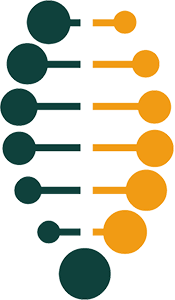

# Digital Service Standard, 2021

The Digital Service Standard sets out 13 points to help Ontario ministries and agencies build and deliver simpler, faster, better government services and products for the people who live and do business in Ontario.

[Read case studies, resources and related rules](https://www.ontario.ca/page/build-ontario-government-services)

---

## Why it matters

The standard helps:

* define what good digital practice looks like in Ontario
* identify the steps teams need to take to get there

The standard is built on the aspirations and experiences of teams across the Ontario Public Service and other jurisdictions, for example:

* Canadian Digital Service and other provinces and territories
* UK’s Government Digital Service
* Australia’s Digital Transformation Agency
* United States Digital Service and 18F

## Release in phases

Ontario’s service design journey follows design and release phases. Each phase is driven by user needs and prioritizes several points from the standard. Learn more about how to work in design and release phases in the [Service Design Playbook] (https://www.ontario.ca/page/service-design-playbook).

| User needs |            |
| ---------- | ---------- |
|  | <h3>Discovery </h3>Conducting user research to understand user needs |
|  | <h3>Alpha </h3>Testing our hypotheses with users using prototypes, models, examples or mock-ups |
|  | <h3>Beta </h3>Developing a minimum viable product or service that adds immediate value for users while the team develops and improves features |
|  | <h3>Live</h3>Continuing to improve the service or product based on user feedback and data |

## 1. Understand users and their needs

Start with users to define the problem. Do research to develop a deep understanding of who the users are, how they behave and what that means for the design of the service.

### Why it matters

Understanding the people who use a service and what they want is critical to building a service that works for them. For example, users of a driver’s license renewal service include any Ontarian with a driver’s license.

It’s easy to make assumptions about users or be influenced by personal experiences. When thinking about users, it’s important to find people with different experiences and perspectives.

It's especially important to include people with disabilities early.

Get to know your users and their needs from their point of view – beyond the lens of the project.

Taking the time to understand the people who use your service will help:

* deliver better solutions and service experiences
* discover additional opportunities and insights
* prevent wasted effort implementing the right idea in the wrong way

It’s helpful to define average users and the not-so-average users (also known as atypical users). Atypical users include those who may be extremely satisfied or extremely dissatisfied with the service. Atypical users are a great source of insight because their needs are generally amplified versions of the more average users.

Use the needs of atypical users as a compass to help articulate the challenges that more digitally savvy users will struggle to voice. This is critical to building tools that work for everyone and avoiding inequalities through digital services.

To inform service features, interview users and gather data to develop:

* **user goals** - written in this format: As a \[user type\], I want
  \[some goal\] so that \[some reason\]
* **user personas** - show user groups based on habits, personality,
  attitudes, abilities and motives
* **user profiles** - show user groups based on demographics such as
  gender, age, location, income and family size

### How to meet this standard

At a minimum:

* list a complete set of users and their needs
* show what groups contributed and what groups did not
* address any gaps when testing during the beta stage
* give examples of user stories, personas and profiles for the service
* identify parts of the service that users find difficult and any
  problems that need to be overcome to design the service

In the next stage:

* test the service with real users, and be able to explain:
  * number of test participants and their basic demographic characteristics
  * how many users involved in testing had accessibility challenges or needed assisted digital support
  * how they were recruited
  * how analytics were used in research
  * any new insights and lessons
* explain any changes identified as a result of researching with users
* discuss user needs that are most difficult to meet
* talk about the design challenges users’ needs pose for the service

In the live stage:

* show research that identifies parts of the task that users find
  difficult
* demonstrate improvements to those areas and how those were tested and
  researched
* talk about how research results will be used to continuously improve
  the service (e.g. participants, frequency, location, timing)
  
## 2. Establish the right team

Put in place a sustainable multidisciplinary team who can design, build and continuously improve the digital service or product led by a skilled product manager who is empowered to make decisions.

**Product managers** set the strategy for and define features of a digital product. They are responsible on an ongoing basis and until a service or product is decommissioned.

**It’s not the same role as a project manager** who is focused on the delivery of a temporary, less iterative process and project.

A digital service or product is anything created for a defined group of users. In this standard, product refers to any online information or transactional part of a service used by people in Ontario.

### Why it matters

It’s important to have a strong multidisciplinary team in place led by one person who is accountable and has the authority to make decisions based on the outcomes of research and testing.

The team’s skills and focus need to evolve as the service or product is designed and developed. The team also needs to adapt its structure based on service or product needs and the phases of work.

To be successful, build a team with:

* a broad mix of skills and roles from the start
* quick decision-making processes and the ability to change and adapt
* the ability to deliver and the resources needed, including senior or executive support

### How to meet this standard

At a minimum:

* work collaboratively
* identify gaps in the team and fill them
* transfer knowledge and skills to others
* dedicate one user researcher to the service/product
* build a team with expertise in agile, lean and digital service delivery, technical, user experience and policy skills
* embed expertise from other business areas and ministries, for example, finance, legal, policy, correspondence, to achieve desired outcomes
* have a product manager with the ability to make day-to-day decisions to improve the service
* continue to improve the service or product after it’s gone live
* involve the maintenance team for the service or product in the early design phases
* make sure the team has senior and executive sponsorship to support their decisions, goals and vision for the service or product

## 3. Be consistent

When the public interacts with the Ontario government, their experience should feel cohesive, positive and consistent.

### Why it matters

Using standard platforms and design is a cost-effective and consistent way of providing public services and makes the most of public resources. Additionally, users need to know and trust when they are:

* on an official government website
* using an official government service or product

From branding to tone of voice and error handling, users should feel confident in their ability to complete their tasks properly and in our ability to guide them to the completion of those tasks.

Use [Ontario’s Design System](https://designsystem.ontario.ca/). It establishes styles and components that follow usability and accessibility best practices and are aligned with Ontario’s visual identity standards.

### How to meet this standard

At a minimum:

* put web content on the government’s flagship website Ontario.ca rather than create any new websites or mobile applications
* use an Ontario.ca/keyword, for example Ontario.ca/ontario-digital-service, for websites and marketing, rather than register new public-facing domain names
* use Ontario.ca as the front door for all applications on other platforms, for example [how the Ontario Student Assistance Program uses Ontario.ca](https://www.ontario.ca/page/osap-ontario-student-assistance-program)
* apply [Ontario.ca content standards](https://www.ontario.ca/page/ontarioca-style-guide) to maintain the consistent tone, voice and style of government content that’s easy to find, understand and use
* use the [Ontario’s Design System](https://designsystem.ontario.ca/) to develop your digital service or product
* demonstrate that the service or product is responsive and has the same content and functionality on all devices, including mobile phones
* register the domain name through
  [domain.registration@ontario.ca](mailto:domain.registration@ontario.ca),
  if needed

### Laws and rules to follow

* [Accessibility for Ontarians with Disabilities Act](https://www.ontario.ca/laws/regulation/r11191#BK9)
   * [Integrated Accessibility Standards Regulation](https://www.ontario.ca/laws/regulation/110191)
      * [Information and Communications Standards](https://www.ontario.ca/laws/regulation/110191#BK8)
* [French Language Services Act](https://www.ontario.ca/laws/statute/90f32), and the [Government services in French](https://www.ontario.ca/page/government-services-french)
* [Ontario Digital and Data Directive](https://www.ontario.ca/page/ontarios-digital-and-data-directive-2021)
* [Ontario Public Service social media guidelines](https://www.ontario.ca/page/ontario-public-service-social-media-guidelines)

## 4. Design the service from start to finish

Understand what users are trying to do and design the simplest, fastest way for them to complete their task and achieve their goal. Where possible, each step of the journey should be completed online.

### Why it matters

It’s important to understand what users are trying to do when they access a service and how that service fits within the broader context of their life.

The service design experience is much more than what people interact with on screen. It begins when they first hear about a service or product and it doesn't end until they achieve their goal or complete their task.

Understand, streamline and refine the complete end-to-end journey users take to complete their objective, including the actions they take in every channel, for example:

* online
* by phone
* by mail
* in person

Every encounter — whether it’s online or offline — needs to be carefully considered to help the user get closer to their end goal.

### How to meet this standard

At a minimum:

* ensure prototypes (models or mock-ups) incorporate the end-to-end user experience
* examine all channels to understand the steps users take to complete their goal and where your service fits into their journey
* show a journey map of all the touch points in a user’s experience from awareness of the service or product to completion of their goal
* have a user research plan that spans every stage of service design up to the 8 launch of a live service or product, including next phases for improvements
* apply lean service design skills to reduce the number of steps a user must take in their end-to-end journey before you begin prototyping
* have a plan for error recovery at each step, for example, if a user gets stuck, how will they ask for and get help?
* demonstrate the results of user research, for example problems found through usability testing, and explain how this informs solutions and improvements to design
* explain the frequency of research and testing, and how results will be applied
do user research from the start with people who have accessibility needs
* use the inclusive design cards to help you sketch, plan, prototype and design
* test with users who need help to access digital tools
* use analytics data in user research and service or product improvements planning

## 5. Ensure users succeed the first time

Using a government service should be an intuitive and stress-free
experience. Good service should be so simple that users can succeed on
their very first attempt without the need for any assistance.

### Why it matters

It’s important to make sure a service, product or task is as simple and straightforward as possible. All users, even those who have accessibility needs or lack digital experience, should be able to complete each step easily.

If a service or product is complex or unclear, users will be forced to contact that organization for help or visit an office in person to complete their task. They may even avoid using the service or product altogether.

Not only does this lead to higher operational costs, but it can also lead to user frustration and a loss of confidence or trust in government.

### How to meet this standard

At a minimum:

* explain the service or product and include who it is for, why it exists and how to use it
* include contact information so users can get help if they need it
* make sure most users will succeed the first time they try to use it
* demonstrate how often you will use research, testing and analytics to improve to the service or product regularly or continuously
* demonstrate that the end-to-end user experience on all channels work and test each of them, including for people who need support accessing digital tools
* do usability testing at least once before and after the service or product goes live and make improvements accordingly
* scale your testing to match the importance of the service or product and the volume of users
* make design and content decisions based on research, testing, analytics and user needs
* make sure people can find the service or product, including by testing its name to know if it makes sense to users
* use analytics and user research to reduce the number of people who didn’t complete the task they set out to do online, for example, to renew their driver’s licence or licence plate sticker

## 6. Test the end-to-end service

Continuously test the end-to-end service to make sure that it remains available to users and free of errors.

Be sure to test with the browsers and devices people will use to access the service, including assistive devices. An assistive device is a piece of equipment a person with a disability may use to help them with daily living, for example a screen reader or a hearing aid.

### Why it matters

Users expect digital services to be simpler, faster and always available. Don’t wait until users discover an error. Monitor the online service and make sure it doesn’t go down at the times when users may be using it. More satisfied users will maintain their trust and confidence in government services.

### How to meet this standard

At a minimum:

* design and test the service or product to work with users’ browsers and devices, including assistive devices
* use a testing environment and context as close as possible to those that users will experience
* provide developers with tools and supports to test the service or product during the build and after its launch
* design a service or product that can accommodate an expected number of users and can scale and support more users if demand increases
* separate content, design and functionality so updates can be made independently
* follow the recommended best practices for coding in your chosen technology and tools
* document how the service or product was built and how it will be maintained, including how this documentation will be kept up-to-date
* have a process for:
   * testing updates or changes made to the service or product regularly
   * monitoring the service or product even when changes are not being made
   * handling failures, for example bugs and outages, and one for notifying users

## 7. Make it accessible

Accessible and inclusive digital design is good for everyone. Make sure the service or product is accessible to all users regardless of their abilities, device, environment or quality of access.

The *Accessibility for Ontarians with Disabilities Act* defines an accessible government website as one that meets all the World Wide Web Consortium [Web Content Accessibility Guidelines (WCAG) 2.0](https://www.w3.org/TR/WCAG20/) level AA success criteria.

### Why it matters

All users, including users with disabilities or people who need help accessing digital tools, should be able to complete their task quickly and easily the first time.

It is also important to look at how factors such as race, gender, cognitive or physical abilities or socio-economic circumstances impact a user’s experience. Use an anti-discriminatory approach and inclusive design best practices to help ensure that users can access the service or product.

When users find it difficult to complete their task the first time, they struggle unnecessarily and may contact the organization for help, impacting the success and satisfaction rates and increasing costs needed to support users trying to access the service or product.

### How to meet this standard

At a minimum:

* have a plan to ensure the service or product meets the WCAG success criteria
* make the service or product accessible, including for users with lower levels of digital skills and limited internet access or connectivity
* integrate automated testing tools into the processes for development and maintenance
* make sure the service or product is usable by people with disabilities by testing it with them, including by testing it manually, with an automated checker, a screen reader and by zooming in to 400% or using a screen magnifier
* make it easy for people with disabilities to get alternate formats if they need them, or to contact the service or product team with any problem they encounter in their journey
* include people with different abilities, including people with different and diverse needs, experiences and backgrounds, using different devices in your user research and testing
* demonstrate how your team will be equipped with a knowledge of barriers to accessibility and be trained to assist users with disabilities in completing tasks and accessing information
* make sure that when new technology platforms are considered you find out about any WCAG 2.0 AA compliance issues and efforts to implement the Authoring Tool Accessibility Guidelines 2.0 (ATAG) Part A & B
* use plain language so services are easier for people to read, understand and use, for example avoid or define legal or technical language and don’t use acronyms

### Laws and rules to follow

* [*Accessibility for Ontarians with Disabilities Act*](https://www.ontario.ca/laws/statute/05a11)
  * [Integrated Accessibility Standards Regulation](https://www.ontario.ca/laws/regulation/110191)
    * [Customer Service Standards](https://www.ontario.ca/laws/regulation/110191#BK148)
    * [Information and Communications Standards](https://www.ontario.ca/laws/regulation/110191#BK8)
* [*Ontario Human Rights Code*](https://www.ontario.ca/laws/statute/90h19)
* [*Ontarians with Disabilities Act*](https://www.ontario.ca/laws/statute/01o32)
* [*Ontario’s Inclusive Design Toolkit*](https://www.ontario.ca/page/inclusive-design-toolkit)
* [*Ontario’s Anti-Racism Act*](https://www.ontario.ca/laws/statute/17a15)
* [*Ontario’s Simpler, Faster, Better Services Act*](https://www.ontario.ca/laws/statute/19s07)

## 8. Be agile and user-centred

Design and build the service or product using an agile and user-centred approach. Agile is an approach to building services that breaks the work into smaller chunks known as iterations. Build and test one feature of the service or product at a time and work towards continuous improvement.

Working in agile is a much lower-risk approach than build-and-approve-it-all-at-once, also known as waterfall. Frequent and incremental iterations expose any flaws in the original plan faster, for example that:

* approvals delayed action
* resources didn’t meet the needs of the service or product
* the team experienced barriers that prevented them from addressing user needs

User research methods such as usability testing put the focus on making services and products that are easy to use. A user-centred approach makes sure that user needs and business needs are considered together. This helps to increase digital service or product uptake and success.

### Why it matters

Agile methods build services that:

* meet user needs
* can be prototyped quickly and tested with users regularly for feedback
* can change easily if, for example, government policy or technology changes
* can keep improving based on user feedback and scale if or when demand increases
* can be built quickly with a minimum set of features and enhanced with more features after the service or product goes live

### How to meet this standard

At a minimum:

* [work in an agile way, using agile tools and techniques](https://www.ontario.ca/page/being-agile-ontario-public-service), and continue
  to do so when the service or product is live
* make sure the team reviews and iterates on the way problems are fixed
* be able to give an example of how the team has responded to user research findings
* demonstrate that the service or product is agile and based on clear and measurable goals
* explore design options for your prototype and explain why some are discarded
* demonstrate how the design of the service or product has changed over time because of user research findings or in response to user needs
* identify any problems found in research and solutions to improve the service or product
* have a quality assurance testing and rollback plan that supports frequent iterations
*use a phased approach to test changes to parts of the service or product when feature-based changes are not feasible

## 9. Use open standards and common platforms

Use open standards, open source software and common government platforms where available.

Open standards are created through collaboration and consensus by an active community of experts, including many large technology companies. The community aims for data operability between various products and services. These practices also consider security, reliability and removing blockers to data sharing within an organization.

Open source software is published publicly and is freely available for anyone to use. It is developed and maintained using a collaborative approach between users, organizations and large companies.

There are many well-established open source tools and products that are considered industry standard.

### Why it matters

Using open standards and common government platforms will help the government:

* save time and money by reusing things that are already available
* move between different technologies when needed
* quickly and easily change a service or product when needed
* give people a more consistent experience using government services or products online
* access a wider range of both open source and proprietary software vendors
* eliminate restrictive long-term contracts

### How to meet this standard

At a minimum:

* identify and use open standards and common platforms
* favour open tools that are accessible and have strong developer community support
* understand common user needs with other services and meet those needs consistently with the rest of government
* demonstrate what the service or product provides to users and in what format or formats
* use common government platforms, for example Ontario.ca for web content
* use APIs and integrate them with any legacy systems where possible or necessary

### Laws and rules to follow

* [Ontario’s Digital and Data Directive](https://www.ontario.ca/page/ontarios-digital-and-data-directive-2021)
* Open standards and common platforms, for example
  * Web publishing on Ontario.ca (internal)
  * News in the Ontario Newsroom (internal)
  * [Ontario's Data Catalogue](https://www.ontario.ca/search/data-catalogue)

## 10. Embed privacy and security by design

Identify the data the service will use, store or create. Put appropriate
legal, privacy and security measures in place so that users feel
confident that their personal information will be kept secure and their
privacy will be respected.

### Why it matters

Users won’t use a service unless they have a guarantee:

* it’s secure
* it's confidential
* they can access their information in the service when they need to
* that their privacy is protected while they use the service, and afterwards

### How to meet this standard

In the early stages of development, explain:

* what data is being collected (name, address, postal code, etc.)
* how the data is being transmitted
* where and how the data is being stored
* how the data will be used
* security threats, including potential pathways for hackers, and tested
  ways of reducing them
* how you plan to keep up-to-date about threats and how to deal with
  them
* any threats of fraud that exist and the controls being prototyped

Also describe your:

* approach to security and risk management
* security and privacy threats
* interactions with business and information risk teams (for example
  Corporate Security and Information, Privacy and Archives)
* privacy and security regulations and how those will be met without
  putting delivery at risk
* any outstanding legal concerns, such as data protection or data
  sharing
* privacy policy and rationale
* process for security updates for servers/software
* plan and process for applying security updates
* plan for checking suspicious activity

When the service is live, describe:

* the approach to security and risk management
* ongoing interactions with the business and information risk teams (for
  example, Corporate Security and Information, Privacy and Archives)
* any outstanding legal concerns, such as data protection or data
  sharing
* the process for understanding new or ongoing threats and how those
  changed during beta
* how the privacy policy will stay up-to-date

### Laws and rules to follow

* [*Freedom of Information and Protection of Privacy Act*](https://www.ontario.ca/laws/statute/90f31)
* [*Archives and Recordkeeping Act*​](https://www.ontario.ca/laws/statute/06a34)
* [*Personal Health Information Protection Act*​](https://www.ontario.ca/laws/statute/04p03)
* [*Personal Information Protection and Electronic Documents Act*](https://www.pwriv.gc.ca/en/privacy-topics/privacy-laws-in-canada/the-personal-information-protection-and-electronic-documents-act-pipeda/r_o_p/)
* [*Canada's Anti-Spam Legislation*](http://fightspam.gc.ca/eic/site/030.nsf/eng/home)

## 11. Encourage people to use digital services

Encourage people to choose the digital service through every interaction
they have with government.

### Why it matters

Encouraging people to use digital service will:

* save money by reducing the number of people using non-digital
  channels, such as call centres
* help users to develop their digital skills
* allow non-digital resources to give more attention to those who can’t use digital services on their
  own

### How to meet this standard

In the early stages of development:

* plan to increase how many people use the digital service
* understand other channels that the service is delivered through
* describe the data collected on other channels and how usage data is
  collected for each
* identify organizations and groups that help users with existing
  digital or non-digital services
* gather insights from research with users, including demographics,
  attitudes, behaviours and channel preferences, and user journey
  maps[3](#f3)
* understand how each channel meets different users’ needs
* design the digital service in a way that gives it clear advantages
  over other channels

In the later stage:

* plan to increase how many people use the digital service and show the
  evidence
* improve communications with users based on user insights
* discuss analytics data about how communication is performing

When the service is live:

* plan to move and increase users to the digital service and include
  yearly targets for 5 years
* measure the expected impact on other service points, such as phone and in person, and how that could impact funding and resource allocation

## 12. Support those who need it

Put tools in place across all channels to support people who cannot use
digital services on their own.

Assisted digital support means providing support to those
who can’t use digital services on their own. This may include options to
help people navigate an online service, such as offering assistance by
phone, chat and in person.

## Why it matters

Not everyone will have the same access, comfort and skill level to use
digital services. Understand how and where users require
support, make that support available, and raise awareness of that
support.

### How to meet this standard

Do user research as early as possible to:

* understand users’ digital skill, confidence and access
* find out why some users can’t use the digital service independently,
  for example language or internet barriers
* find out user needs for support

In later stages of development, make sure assisted digital support is:

* sustainable and free to use
* well understood and documented
* supported by appropriate recruitment and research methods
* selected and explained through stories, personas and profiles of people who need it

Conduct research and testing with users who:

* already use the service or would use it
* have the lowest level of digital skills, confidence and access
* currently seek assisted digital support from others (for example, friends and
  family, colleagues, companies or charities)

Respond to user research by:

* learning from it and supporting testing to improve assisted digital support
* designing an assisted digital support model to meet user needs
* committing to participating in ongoing user research to discover digital support needs

### Laws and rules to follow

* [*Accessibility for Ontarians with Disabilities Act, Information and Communication Standard*](https://www.ontario.ca/laws/regulation/r11191#BK9)

## 13. Measure performance

Continuously capture and monitor performance data to inform ongoing
service improvements.

### Why it matters

Measuring performance means continuously improving a service by:

* learning its strengths and weaknesses
* using data to support changes

### How to meet this standard

At a minimum:

* use web analytics to capture information about user behaviour online
* determine data needs, sources and collection
* monitor and evaluate user feedback and complaints from the digital
  service and other service touch-points such as phone and in person
* analyze performance and identify actionable data insights as early as
  possible
* use qualitative and quantitative data to understand user needs and
  identify areas for change
* define performance metrics for the service up-front, early on in the
  design process
* regularly review the technology used to provide the service and the processes that support the service
* base your service review frequency on the volume of users (e.g. 10,000 or less unique users per year = 2 year review cycle; 10,000-100,000 = annual; 100,000-1 million = every 6 months)
* use data to determine the cost per use for each channel, accounting for the cost to build and ongoing maintenance as well
* demonstrate how service performance compares to other similar
  government and private sector services
* share your review findings with leadership

## 14. Test with the minister

Test or demo the service from beginning to end with the responsible
minister before the service goes live.

### Why it matters

Ministers are responsible for delivering on the government’s priorities
for the people of Ontario, so you need to show them the digital service
before it goes live. When the ministers can understand and are experienced with a product, and feel that it is user-centric, they can trust that it will serve the public well.

### How to meet this standard

At a minimum:

* share your user research with the minister and demonstrate a prototype of the service
* show the service to the minister(s) responsible for it
* if it’s a transactional service, have the minister(s) test the end-to-end
service to ensure that they can get through it the way a constituent
would have to (during usability testing phase early on in the project)

---

## Why it matters

TThis Digital Service Standard was developed for the Ontario government to use as we design online information and transactional services for the people of Ontario.

We believe that the best digital service is convenient, intuitive and easy to use. The purpose of the Digital Service Standard is to help the Ontario government deliver consistently good services online.

The standard will help us:
* define what good digital service looks like in Ontario
* identify the steps we need to take to get there

We looked near and far to develop this standard. It’s built on the aspirations and experiences of teams across the Ontario Public Service, as well as other jurisdictions, especially Gov.UK, USDS and 18F.

## Contributing to the standard

We test the Digital Service Standard to gather user feedback and improve it.

Share your feedback, thoughts and ideas or volunteer for future testing by email at digital.standard@ontario.ca or by forking our GitHub repository

### By email

* Send plain text formats like text files, Word documents and Google docs
* Do not send HTML, PDF, printed paper or handwritten notes
* Tell us what section your suggestions apply to or if they apply to the overall document
* Include the original text for reference and your proposed changes if you are sending text file or email
* Use track changes or suggest mode if you are sending Word or Google documents
* Tell us the reason for your suggestion and the benefit it will have

### On GitHub

*NOTE*: The develop branch is a working draft. The official standard is in the master branch and on Ontario.ca.

* Use markdown to format your changes
* Don't use HTML unless the changes you want to make are not supported in markdown (for example, headings inside a table)
* Fork off of our develop branch and when you are done make a pull request back to develop
* Name your branch with your first name or user name, the type of change (fix for typos, grammar edits or feature for any additions or deletions), followed by a description of your changes name/fix/my-changes OR name/feature/my-changes
* Make one commit per change and explain the reason for your change in your commit message (not what you changed, but why)

(Open Government Licence – Ontario)[https://www.ontario.ca/page/open-government-licence-ontario]
